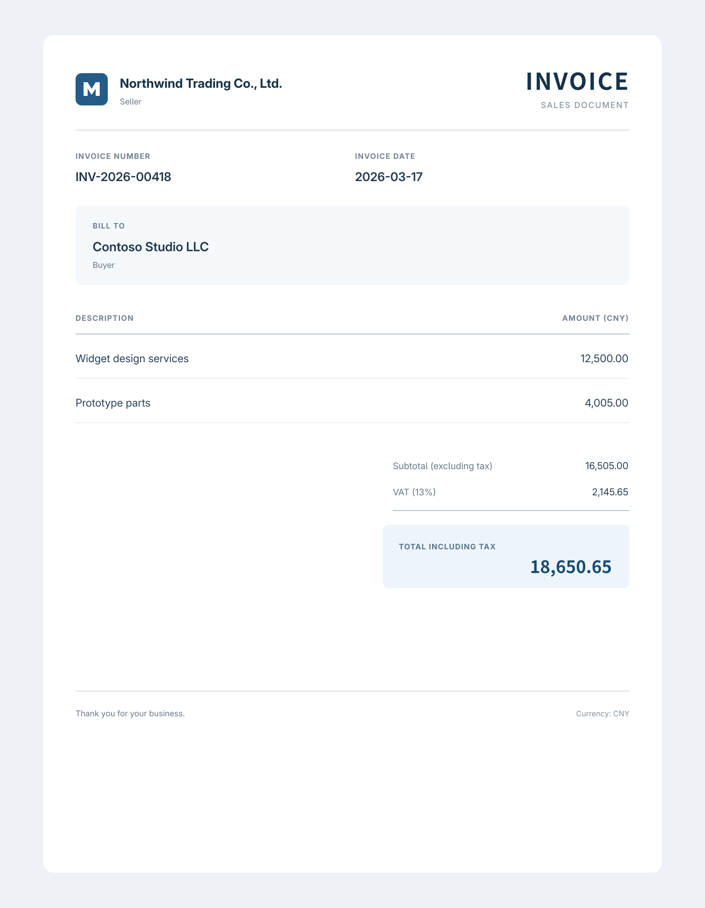

# FillForge example: Invoice template

A complete invoice example for testing the image-to-document workflow. It includes a DOCX template,
matching field configuration, a clean invoice image, equivalent source text, and a valid extraction
result for testing the manual import path.



## Files

| File | Role |
| --- | --- |
| `invoice/invoice-template.docx` | Word template with eight `{placeholder}` tags. |
| `invoice/template.yaml` | Five business fields, bindings, validation, and transforms. Its ID matches the ID generated when importing `invoice-template.docx`. |
| `invoice/invoice-source.png` | Clean, high-resolution invoice image to select as a run source. |
| `invoice/invoice-source.svg` | Editable source used to render the PNG. |
| `invoice/source-text.txt` | Text equivalent of the image for manual prompt testing. |
| `invoice/extraction-input.json` | Valid AI-style response for testing JSON import without an AI request. |

From `examples/invoice`, regenerate the PNG with `rsvg-convert --format=png --output=invoice-source.png invoice-source.svg`.

The invoice contains two line items, a subtotal of 16,505.00, 13% VAT of 2,145.65, and a total
including tax of 18,650.65. The date and total also fill multiple DOCX placeholders: `invoice_date`
becomes `{invoice_year}-{invoice_month}-{invoice_day}`, and `total_amount` feeds
`{total_amount_uppercase}` through the `chinese_currency_uppercase` transform.

## Try it in the desktop app

1. Open Templates -> Import DOCX and select `invoice/invoice-template.docx`. FillForge generates the
   template ID `invoice-template` from the filename.
2. Replace the generated `template.yaml` in
   `<home>/.local/fillforge/templates/invoice-template/` with `invoice/template.yaml`.
3. Confirm the placeholder report lists all eight placeholders with no unconfigured placeholders or
   unreferenced fields.
4. Start a run with `invoice/invoice-source.png`. Choose **Extract with AI** to test image extraction
   with a configured vision-capable connection. To test the rest of the workflow without a model,
   open **Advanced tools** and import `invoice/extraction-input.json`. `source-text.txt` is an
   alternative source for manual prompt testing.
5. Review the five values, create the document, and inspect the generated DOCX.

## Verify from the CLI

Import the DOCX and install the example configuration in the same data home used by the desktop app.
Set `FILLFORGE_HOME` to that home directory when launching both the app and CLI. FillForge stores its
data under `$FILLFORGE_HOME/.local/fillforge`.

```sh
FILLFORGE_HOME=/tmp/fillforge-example cargo run -p fillforge-cli --bin fillforge -- inspect-template invoice-template
FILLFORGE_HOME=/tmp/fillforge-example cargo run -p fillforge-cli --bin fillforge -- extract-fields invoice-template
FILLFORGE_HOME=/tmp/fillforge-example cargo run -p fillforge-cli --bin fillforge -- validate-fields invoice-template examples/invoice/extraction-input.json
```
